# Custom Sidebar Examples

These are vibe-coded cmux sidebars that run as interpreted SwiftUI-style files.
They do not need Xcode, signing, or a build step.

The examples intentionally keep their labels inline because interpreted
sidebars do not have a localization catalog yet.

Start with one of the six curated built-in templates from the app or CLI:

```bash
cmux sidebar templates
cmux sidebar try agents-board
cmux sidebar new agents-board --from agents-board
cmux sidebar open agents-board
```

In the app, right-click the sidebar toggle button and choose **Browse Sidebar Templates…**
to see the gallery. Try a template before keeping it, or use it and edit the file later.

The curated previews are also shown in the [custom-sidebar guide](../../docs/custom-sidebars.md#curated-gallery).

| Template | Light | Dark |
| --- | --- | --- |
| Workspaces | 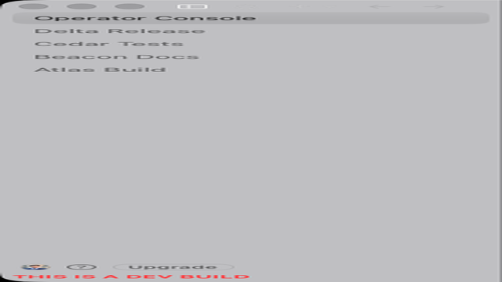 | 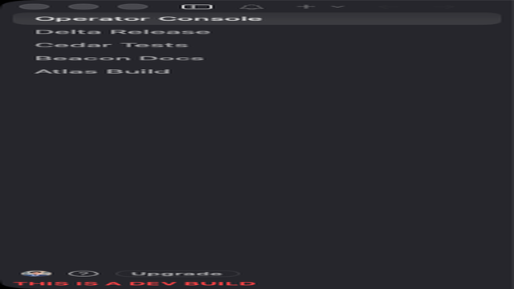 |
| Agents Board | 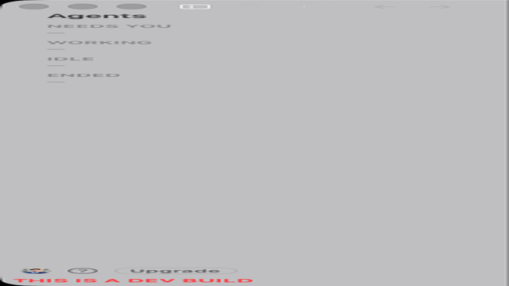 | 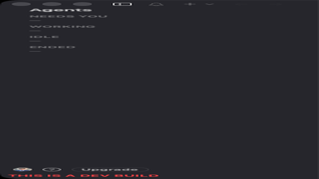 |
| Panel Sessions | 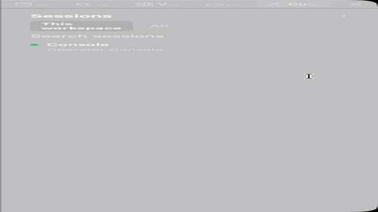 | 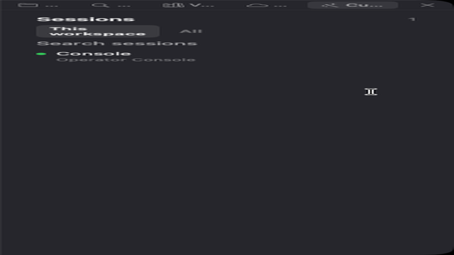 |
| Panel Subagents | 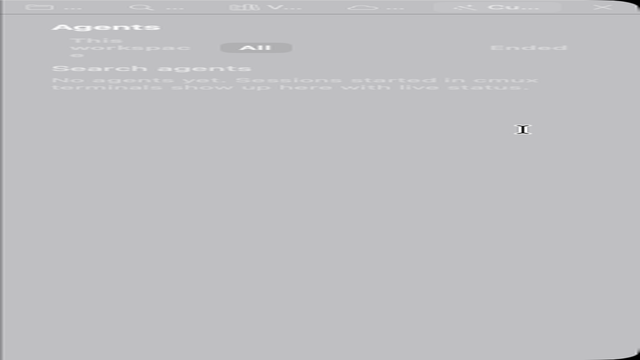 | 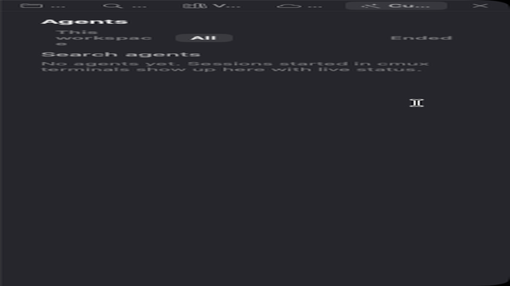 |
| btop Agents | 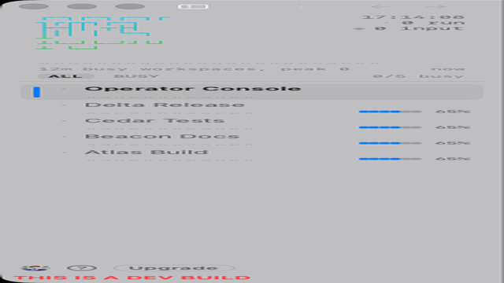 | 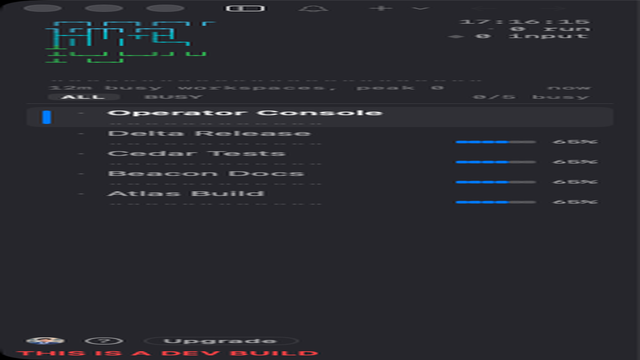 |
| Panel Todo | 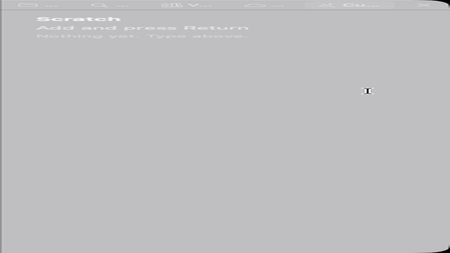 | 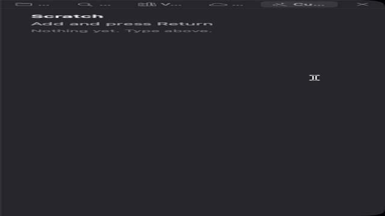 |

You can also copy any source file from this directory into
`~/.config/cmux/sidebars/`. Enable **Settings -> Beta features -> Custom sidebars**
then pick it from the sidebar toggle button's right-click menu. The manifest lists
the bundled templates' display name, description, and intended placement. The other
examples remain available here as authoring references.

## Included Sidebars

- `status-board.swift`: groups workspaces into urgent, review, progress,
  research, and done lanes using live PR, branch, progress, unread, and prompt
  signals.
- `finder.swift`: a macOS Finder-style workspace browser with a source list,
  selected workspace inspector, and tab list.
- `btop-agents.js`: agent activity in the spirit of btop. Each workspace shows
  a braille sparkline of how busy its agents were over the last six minutes,
  a state glyph (spinner while working, amber diamond when waiting for input),
  a tiny progress meter, unread count and PR number. The header graphs busy
  workspaces over twelve minutes. Click a row to select it, drag to reorder,
  and use BUSY to hide quiet workspaces. Install with
  `cp Examples/CustomSidebars/btop-agents.js ~/.config/cmux/sidebars/` and
  `cmux sidebar select btop-agents`.

See `docs/custom-sidebars.md` for the full authoring contract.
