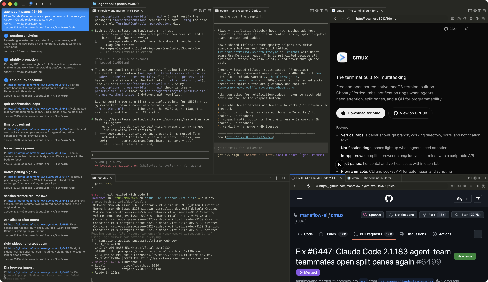

<h1 align="center">PanEcho (pane + echo)</h1>
<p align="center">A Ghostty-based macOS terminal with vertical tabs and notifications for AI coding agents</p>

<p align="center">
  <a href="https://github.com/xxshubhamxx/cmux-panecho/releases/latest/download/Panecho.dmg">
    
  </a>
</p>


<p align="center">
  <a href="https://github.com/xxshubhamxx/cmux-panecho"></a>
</p>

<p align="center">
  
</p>

<p align="center">
  Inspired by <a href="https://github.com/manaflow-ai/cmux">cmux</a>
</p>

## Features

<table>
<tr>
<td width="40%" valign="middle">
<h3>Notification rings</h3>
Panes get a blue ring and tabs light up when coding agents need your attention
</td>
<td width="60%">

</td>
</tr>
<tr>
<td width="40%" valign="middle">
<h3>Notification panel</h3>
See all pending notifications in one place, jump to the most recent unread
</td>
<td width="60%">

</td>
</tr>
<tr>
<td width="40%" valign="middle">
<h3>In-app browser</h3>
Split a browser alongside your terminal with a scriptable API ported from <a href="https://github.com/vercel-labs/agent-browser">agent-browser</a>
</td>
<td width="60%">

</td>
</tr>
<tr>
<td width="40%" valign="middle">
<h3>Vertical + horizontal tabs</h3>
Sidebar shows git branch, linked PR status/number, working directory, listening ports, and latest notification text. Split horizontally and vertically.
</td>
<td width="60%">

</td>
</tr>
<tr>
<td width="40%" valign="middle">
<h3>SSH</h3>
<code>cmux ssh user@remote</code> creates a workspace for a remote machine. Browser panes route through the remote network so localhost just works. Drag an image into a remote session to upload via scp.
</td>
<td width="60%">

</td>
</tr>
<tr>
<td width="40%" valign="middle">
<h3>Claude Code Teams</h3>
<code>cmux claude-teams</code> runs Claude Code's teammate mode with one command. Teammates spawn as native splits with sidebar metadata and notifications. No tmux required.
</td>
<td width="60%">

</td>
</tr>
</table>

- **Browser import** — Import cookies, history, and sessions from Chrome, Firefox, Arc, and 20+ browsers so browser panes start authenticated
- **Custom commands** — Define project-specific actions in [`cmux.json`](https://cmux.com/docs/custom-commands) that launch from the command palette
- **Programmable** — CLI and socket API to create workspaces, split panes, send keystrokes, and automate the browser
- **Native macOS app** — Built with Swift and AppKit, not Electron. Fast startup, low memory.
- **Ghostty compatible** — Reads your existing `~/.config/ghostty/config` for themes, fonts, and colors
- **GPU-accelerated** — Powered by libghostty for smooth rendering
- **cmux command compatibility** — All existing `cmux` commands are supported so tools built on top of cmux remain compatible with panecho
- **Keyboard shortcuts** — [Extensive shortcuts](https://cmux.com/docs/keyboard-shortcuts) for workspaces, splits, browser, and more
- **Open source** — Free and GPL-licensed

## Install

### DMG (recommended)

<a href="https://github.com/xxshubhamxx/cmux-panecho/releases/latest/download/Panecho.dmg">
  
</a>

Download [Panecho.dmg](https://github.com/xxshubhamxx/cmux-panecho/releases/latest/download/Panecho.dmg), open the `.dmg`, and drag panecho to your Applications folder.

This is the recommended and only supported way to install panecho.

On first launch, macOS may ask you to confirm opening an app from an identified developer. Click **Open** to proceed.

## Why panecho?

panecho is inspired by [cmux](https://github.com/manaflow-ai/cmux) and keeps the same spirit of a fast, native, scriptable terminal workspace for AI coding agents.

I run a lot of Claude Code and Codex sessions in parallel. I was using Ghostty with a bunch of split panes, and relying on native macOS notifications to know when an agent needed me. But Claude Code's notification body is always just "Claude is waiting for your input" with no context, and with enough tabs open I couldn't even read the titles anymore.

I tried a few coding orchestrators but most of them were Electron/Tauri apps and the performance bugged me. I also just prefer the terminal since GUI orchestrators lock you into their workflow. panecho is a native macOS app in Swift/AppKit. It uses libghostty for terminal rendering and reads your existing Ghostty config for themes, fonts, and colors.

The main additions are the sidebar and notification system. The sidebar has vertical tabs that show git branch, linked PR status/number, working directory, listening ports, and the latest notification text for each workspace. The notification system picks up terminal sequences (OSC 9/99/777) and has a CLI (`cmux notify`) you can wire into agent hooks for Claude Code, OpenCode, etc. When an agent is waiting, its pane gets a blue ring and the tab lights up in the sidebar, so you can tell which one needs attention across splits and tabs. Cmd+Shift+U jumps to the most recent unread.

The in-app browser has a scriptable API ported from [agent-browser](https://github.com/vercel-labs/agent-browser). Agents can snapshot the accessibility tree, get element refs, click, fill forms, and evaluate JS. You can split a browser pane next to your terminal and have Claude Code interact with your dev server directly.

Everything is scriptable through the CLI and socket API — create workspaces/tabs, split panes, send keystrokes, open URLs in the browser.

## Compatibility

panecho is inspired by [cmux](https://github.com/manaflow-ai/cmux) and is designed to remain compatible with tools, scripts, hooks, and workflows built on top of cmux.

All existing `cmux` commands are supported in panecho so current automation, wrappers, helper scripts, and agent tooling can continue to work without forcing a migration of command names.

That means commands such as `cmux ssh`, `cmux claude-teams`, `cmux notify`, `cmux hooks setup`, `cmux restore-session`, and `cmux surface resume ...` are intentionally preserved for compatibility.

## The Zen of panecho

panecho is not prescriptive about how developers hold their tools. It's a terminal and browser with a CLI, and the rest is up to you.

panecho is a primitive, not a solution. It gives you a terminal, a browser, notifications, workspaces, splits, tabs, and a CLI to control all of it. panecho doesn't force you into an opinionated way to use coding agents. What you build with the primitives is yours.

The best developers have always built their own tools. Nobody has figured out the best way to work with agents yet, and the teams building closed products definitely haven't either. The developers closest to their own codebases will figure it out first.

Give a million developers composable primitives and they'll collectively find the most efficient workflows faster than any product team could design top-down.

## Documentation

For more info on how to configure panecho, head over to the [cmux docs](https://cmux.com/docs/getting-started?utm_source=readme). panecho stays compatible with the existing `cmux` command surface so the documentation remains useful.

## Keyboard Shortcuts

### Workspaces

| Shortcut | Action |
|----------|--------|
| ⌘ N | New workspace |
| ⌘ 1–8 | Jump to workspace 1–8 |
| ⌘ 9 | Jump to last workspace |
| ⌃ ⌘ ] | Next workspace |
| ⌃ ⌘ [ | Previous workspace |
| ⌘ ⇧ W | Close workspace |
| ⌘ ⇧ R | Rename workspace |
| ⌥ ⌘ E | Edit workspace description |
| ⌘ B | Toggle sidebar |
| ⌥ ⌘ B | Toggle right sidebar |
| ⌘ ⇧ E | Toggle right sidebar focus |

### Surfaces

| Shortcut | Action |
|----------|--------|
| ⌘ T | New surface |
| ⌘ ⇧ ] | Next surface |
| ⌘ ⇧ [ | Previous surface |
| ⌃ Tab | Next surface |
| ⌃ ⇧ Tab | Previous surface |
| ⌃ 1–8 | Jump to surface 1–8 |
| ⌃ 9 | Jump to last surface |
| ⌘ W | Close surface |

### Split Panes

| Shortcut | Action |
|----------|--------|
| ⌘ D | Split right |
| ⌘ ⇧ D | Split down |
| ⌥ ⌘ ← → ↑ ↓ | Focus pane directionally |
| ⌘ ⇧ H | Flash focused panel |

### Browser

Browser developer-tool shortcuts follow Safari defaults and are customizable in `Settings → Keyboard Shortcuts`.
Command palette navigation shortcuts, including ⌃ P, are also customizable and can be cleared so the keypress reaches the active terminal.

| Shortcut | Action |
|----------|--------|
| ⌘ ⇧ L | Open browser in split |
| ⌘ L | Focus address bar |
| ⌘ [ | Back |
| ⌘ ] | Forward |
| ⌘ R | Reload page |
| ⌥ ⌘ I | Toggle Developer Tools (Safari default) |
| ⌥ ⌘ C | Show JavaScript Console (Safari default) |

### Notifications

| Shortcut | Action |
|----------|--------|
| ⌘ I | Show notifications panel |
| ⌘ ⇧ U | Jump to latest unread |
| ⌥ ⌘ U | Toggle current item unread state |
| ⌃ ⌘ U | Mark current item as oldest unread and jump to next latest unread |

### Find

| Shortcut | Action |
|----------|--------|
| ⌘ F | Find |
| ⌘ ⇧ F | Find in directory |
| ⌘ G / ⌥ ⌘ G | Find next / previous |
| ⌥ ⌘ ⇧ F | Hide find bar |
| ⌘ E | Use selection for find |

### Terminal

| Shortcut | Action |
|----------|--------|
| ⌘ K | Clear scrollback |
| ⌘ C | Copy (with selection) |
| ⌘ V | Paste |
| ⌘ + / ⌘ - | Increase / decrease font size |
| ⌘ 0 | Reset font size |

### Window

| Shortcut | Action |
|----------|--------|
| ⌘ ⇧ N | New window |
| ⌘ ⇧ O | Reopen previous session |
| ⌘ , | Settings |
| ⌘ ⇧ , | Reload configuration |
| ⌘ Q | Quit |

## Nightly Builds

[Download panecho NIGHTLY](https://github.com/xxshubhamxx/cmux-panecho/releases/latest/download/Panecho.dmg)

panecho NIGHTLY is a separate app with its own bundle ID, so it can run alongside the stable version if you choose to ship separate nightlies. Built automatically from the latest `main` commit and can auto-update via its own Sparkle feed.

Report nightly bugs on [GitHub Issues](https://github.com/xxshubhamxx/cmux-panecho/issues).

## Session restore

Quitting panecho saves the current session. On relaunch, panecho restores app-owned
state:
- Window/workspace/pane layout
- Working directories
- Terminal scrollback (best effort)
- Browser URL and navigation history

panecho does not checkpoint arbitrary live process state. tmux, vim, shells, and
unsupported terminal apps reopen as normal terminals.

Supported agent sessions can resume when hooks have saved a native session ID.
Install hooks after installing the agent CLI so its binary is on `PATH`:

```bash
cmux hooks setup
cmux hooks setup codex
cmux hooks setup --agent opencode
```

`cmux hooks setup` installs supported agents it can find and prints a summary
for skipped agents. Supported resume integrations include Claude Code, Codex,
Grok, OpenCode, Pi, Amp, Cursor CLI, Gemini, Rovo Dev, Copilot, CodeBuddy,
Factory, and Qoder. Claude Code is handled by the cmux Claude wrapper when Claude
integration is enabled in Settings.

Advanced users and integrations can attach a custom resume command to the
current terminal surface. This is useful for tools with their own durable state,
such as tmux sessions or custom agent CLIs:

```bash
cmux surface resume set --kind tmux --checkpoint work --shell "tmux attach -t work"
cmux surface resume show --json
cmux surface resume clear --checkpoint work
```

The binding stays attached to the panecho surface. Public CLI or socket-created
bindings are stored for inspection and manual restore unless you approve a
signed command prefix for automatic restore. Approved prefixes are also bound to
the working directory and exact environment values, when present. Review or edit
approvals in **Settings > Terminal > Resume Commands**. panecho only auto-runs
resume bindings it marks trusted, such as live process-detected tmux bindings or
user-approved prefixes. Sensitive environment keys such as tokens, passwords,
secrets, and API keys are dropped before a resume binding is stored.

To keep restored agent terminals idle instead of automatically running their resume commands,
turn off **Settings > Terminal > Resume Agent Sessions on Reopen** or set this in
`~/.config/cmux/cmux.json`:

```json
{
  "terminal": {
    "autoResumeAgentSessions": false
  }
}
```

This only disables automatic agent resume commands. panecho still restores the saved layout,
working directories, scrollback, and browser history.

If you need to reapply the last saved snapshot manually, use:
- `File > Reopen Previous Session`
- `⌘ ⇧ O`
- `cmux restore-session`

Under the hood, panecho writes a versioned snapshot under
`~/Library/Application Support/cmux/` and agent hooks write session mappings
under `~/.cmuxterm/`. On restore, panecho rebuilds the layout first, then runs the
supported agent's native resume command when automatic agent resume is enabled.

Read the full guide at <https://cmux.com/docs/session-restore>.

## FAQ

### How does cmux relate to Ghostty?

cmux is not a fork of Ghostty. It uses [libghostty](https://github.com/ghostty-org/ghostty) as a library for terminal rendering, the same way apps use WebKit for web views. Ghostty is a standalone terminal; cmux is a different app built on top of its rendering engine.

### What platforms does it support?

macOS only, for now. cmux is a native Swift + AppKit app.

### Is there an iOS app?

Yes, in beta. Pair your iPhone with your Mac from the Mobile Connect window and attach to your terminals from your phone, with optional forwarding of terminal notifications. It ships on TestFlight as cmux BETA. Early access is included with [cmux Founders Edition](https://github.com/manaflow-ai/cmux#founders-edition). See the [iOS docs](https://cmux.com/docs/ios).

### What coding agents does cmux work with?

All of them. cmux is a terminal, so any agent that runs in a terminal works out of the box: Claude Code, Codex, OpenCode, Gemini CLI, Kiro, Aider, Goose, Amp, Cline, Cursor Agent, and anything else you can launch from the command line.

### Can cmux orchestrate multiple agents and subagents?

Yes. When an agent spawns subagents or teammates, cmux turns them into native panes and splits instead of hidden background processes. It supports [Claude Code teams](https://cmux.com/docs/agent-integrations/claude-code-teams) and [oh-my-opencode](https://cmux.com/docs/agent-integrations/oh-my-opencode) multi-model orchestration, so every agent in a run is visible and controllable.

### Can I use cmux with remote machines?

Yes. Open workspaces over SSH and attach to remote tmux sessions, so agents can run on a remote host while you drive them from cmux. See [SSH and remote](https://cmux.com/docs/ssh).

### How do notifications work?

When a process needs attention, cmux shows notification rings around panes, unread badges in the sidebar, a notification popover, and a macOS desktop notification. These fire automatically via standard terminal escape sequences (OSC 9/99/777), or you can trigger them with the [cmux CLI](https://cmux.com/docs/notifications#cli-usage) and [agent hooks](https://cmux.com/docs/notifications#integration-examples). Any agent that supports hooks or OSC works, including Claude Code, Codex, OpenCode, and pi.

### Is cmux programmable?

Yes. Every action is available through the cmux CLI and a Unix socket: create workspaces, open split panes, send input, read screen contents, take screenshots, and drive the in-app browser. See the [CLI reference](https://cmux.com/docs/api) and [browser automation](https://cmux.com/docs/browser-automation) docs.

### What can the built-in browser do?

cmux can split a real browser pane next to your terminal, and it is fully programmable: navigate, snapshot the DOM, click, type, evaluate JavaScript, and read console and network activity over the same socket API. Agents use it to verify their own web changes without leaving cmux. See [browser automation](https://cmux.com/docs/browser-automation).

### Does cmux have skills?

Yes. Skills are reusable workflows you can give any agent running in cmux, for things like CLI control, workspace automation, settings, and browser surfaces. Browse the open collection at [cmux-skills](https://github.com/manaflow-ai/cmux-skills), or read the [skills docs](https://cmux.com/docs/skills).

### Can I customize keyboard shortcuts?

Terminal keybindings are read from your Ghostty config file (`~/.config/ghostty/config`). cmux-specific shortcuts (workspaces, splits, browser, notifications) can be customized in Settings. See the [default shortcuts](https://cmux.com/docs/keyboard-shortcuts) for a full list.

### Can I customize cmux?

Yes. Terminal rendering uses your Ghostty config, so themes, fonts, colors, and cursor carry over directly. cmux's own settings in `~/.config/cmux/cmux.json` control the sidebar, tab bar, split panes, and behavior, and every [keyboard shortcut](https://cmux.com/docs/keyboard-shortcuts) is editable. See [configuration](https://cmux.com/docs/configuration).

### Are my sessions saved?

Yes. cmux restores your windows, workspaces, panes, working directories, and scrollback when you relaunch, and the state survives a full computer restart, not just quitting the app. Agent sessions like Claude Code, Codex, and OpenCode come back too. See [session restore](https://cmux.com/docs/session-restore).

### How does it compare to tmux?

tmux is a terminal multiplexer that runs inside any terminal. cmux is a native macOS app with a GUI: vertical tabs, split panes, an embedded browser, and a socket API, all built in, no config files or prefix keys needed. That said, lots of people happily run cmux with SSH and tmux together, and cmux can attach to your remote tmux sessions natively ([beta](https://cmux.com/docs/remote-tmux)).

### Is cmux free?

Yes, cmux is free to use. The source code is available on [GitHub](https://github.com/manaflow-ai/cmux).

### How can I support cmux?

cmux is free and open source, and always will be. If you want to back development and get early access to what's next, including cmux AI, the iOS app, and Cloud VMs, check out [cmux Founders Edition](https://github.com/manaflow-ai/cmux#founders-edition).

### I have a feature request or found a bug?

We want to hear it. Open an [issue](https://github.com/manaflow-ai/cmux/issues) or [pull request](https://github.com/manaflow-ai/cmux/pulls) on GitHub, or [email us](mailto:founders@manaflow.com?subject=cmux%20feature%20request).

## Star History

<a href="https://star-history.com/#xxshubhamxx/cmux-panecho&Date">
 <picture>
   <source media="(prefers-color-scheme: dark)" srcset="https://api.star-history.com/svg?repos=xxshubhamxx/cmux-panecho&type=Date&theme=dark" />
   <source media="(prefers-color-scheme: light)" srcset="https://api.star-history.com/svg?repos=xxshubhamxx/cmux-panecho&type=Date" />
   
 </picture>
</a>

## Contributing

Ways to get involved:

- Follow the project on GitHub for updates and releases
- Create and participate in [GitHub issues](https://github.com/xxshubhamxx/cmux-panecho/issues)
- Let us know what you're building with panecho
- Share compatibility issues if any workflow built on top of cmux needs extra support in panecho

## Community

- [GitHub](https://github.com/xxshubhamxx/cmux-panecho)
- [Issues](https://github.com/xxshubhamxx/cmux-panecho/issues)
- [Releases](https://github.com/xxshubhamxx/cmux-panecho/releases)

<p>
  <strong>WeChat:</strong> Scan the QR code to join the community.<br />
  
</p>

## Founder's Edition

panecho is free, open source, and always will be.

If you'd like to support development and get early access to what's coming next:

- Prioritized feature requests and bug fixes
- Early access features and experiments
- Faster iteration on workflows for AI coding agents

## License

panecho is open source under [GPL-3.0-or-later](LICENSE).
