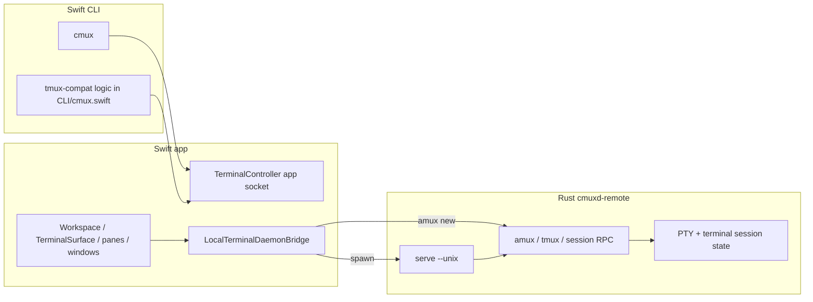
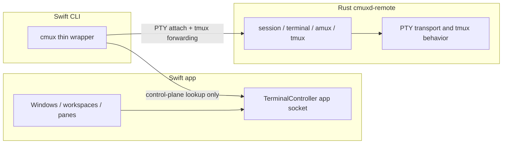

# PTY CLI Architecture

This is the current split between Swift and Rust on `feat-amux-rust-backend`, and the boundary we should move to if `cmux pty` is going to work cleanly.

## Short answer

Yes, this makes sense.

Socket events alone are not enough for a real PTY CLI. A PTY client needs a bidirectional data plane:

- create or open a session
- attach
- read terminal bytes
- write terminal bytes
- resize on `SIGWINCH`
- detach
- detect EOF and exit

Rust already has most of that. Swift still owns a lot of control-plane and tmux-compat glue.

## Current architecture

## What is in Rust right now

Rust already owns the terminal session transport:

- `terminal.open`
- `terminal.read`
- `terminal.write`
- `session.attach`
- `session.resize`
- `session.detach`
- `session.status`
- `session.list`
- `session.history`
- `amux.capture`
- `amux.wait`
- `amux.events.read`
- `tmux.exec`

The interactive Rust CLI path already uses those calls end to end:

- `cmuxd-remote session new`
- `cmuxd-remote session attach`
- raw terminal mode
- `SIGWINCH` resize propagation
- continuous `terminal.read`
- stdin to `terminal.write`

So the PTY loop is not theoretical. It already exists in Rust.

## What is still in Swift right now

The Swift app still owns UI and app-local control:

- windows
- workspaces
- panes
- focus and selection
- app socket API in `TerminalController`

The Swift CLI still owns a lot of tmux-compat behavior in `CLI/cmux.swift`:

- it connects to the app socket with `SocketClient`
- it resolves current workspace and pane from app state
- it implements many tmux commands by calling app socket methods like `workspace.create`, `workspace.rename`, `surface.split`, `surface.send_text`, `surface.read_text`, `pane.list`
- some compatibility features are still purely local Swift CLI behavior, not Rust daemon behavior:
  - `pipe-pane` shells out locally after `surface.read_text`
  - `wait-for` uses filesystem signal files
  - buffers and hooks live in `~/.cmuxterm/tmux-compat-store.json`

That means Swift CLI currently does more than forwarding.

## Important current coupling

The app already launches local terminal panels through the Rust daemon:

- `Workspace.makeTerminalPanel(...)` calls `LocalTerminalDaemonBridge.startupCommand(...)`
- that runs `cmuxd-remote amux new <sessionID> --socket <socket> -- <command>`
- today `sessionID` is the terminal surface UUID, so `session_id == surface.id`

That is useful because it gives us a stable bridge between app pane identity and Rust session identity.

## Current control plane vs PTY plane

| Area | Current owner |
| --- | --- |
| App windows, panes, focus, selection | Swift app |
| App Unix socket API | Swift app |
| Local daemon startup and discovery | Swift app |
| PTY lifecycle and terminal byte stream | Rust daemon |
| Interactive attach loop | Rust daemon |
| `amux` capture, wait, events | Rust daemon |
| `tmux.exec` subset | Rust daemon |
| tmux-compat command parsing and fallback behaviors | Swift CLI |

## Why socket events are not enough

`amux.events.read` is useful for state change notification, but it does not replace a PTY stream.

A usable `cmux pty` command needs all of these at minimum:

- an interactive attach path
- streaming reads with offsets or backpressure
- writes for stdin bytes
- resize propagation
- detach semantics
- exit or EOF semantics

Events are side-band signals. PTY attach is the main data plane.

## Desired architecture

## What should move to Rust

If we want `cmux pty` to be real and for the Swift CLI to mostly forward, Rust should own:

- PTY attach and detach
- PTY read and write
- resize handling
- capture and wait
- exit status and EOF
- tmux compatibility that is actually about terminal sessions
- buffer, wait, and pipe behaviors that should match the daemon session model

Swift should keep:

- app UI state
- focus and selection
- current workspace and pane discovery
- non-terminal app features like browser, notifications, window management

## Minimal forwarding boundary

The clean boundary is:

1. Swift resolves which pane or surface the user means.
2. Swift resolves the daemon socket and Rust `session_id`.
3. Swift forwards the PTY operation to Rust.

For the local app path, step 2 is already close to trivial because `session_id` is the surface UUID.

## Concrete implication for `cmux pty`

I think `cmux pty` should not be implemented as another Swift-side pseudo-terminal feature.

It should be a thin path over Rust operations, probably one of:

- Swift CLI shells out to the Rust daemon binary for interactive subcommands
- Swift CLI talks directly to the Rust daemon socket for PTY subcommands

Either way, the Swift CLI should stop owning PTY semantics.

## Gaps before that architecture is true

These are the main things still not aligned:

- Swift CLI still implements tmux-compat itself against the app socket
- some tmux-compat features are local-only Swift behavior, not daemon behavior
- there is no dedicated `cmux pty` forwarding surface yet
- the app socket is still the source of truth for current pane selection, but the Rust daemon is the source of truth for terminal bytes

## Recommendation

Do the next pass in this order:

1. Add a small Swift control-plane lookup that returns `workspace_id`, `surface_id`, `session_id`, and daemon socket for the current or requested pane.
2. Add `cmux pty ...` in Swift as a thin forwarder to Rust.
3. Move tmux-compat commands that are really PTY or tmux session behavior out of `CLI/cmux.swift` and into Rust.
4. Keep only app-specific commands in Swift.
